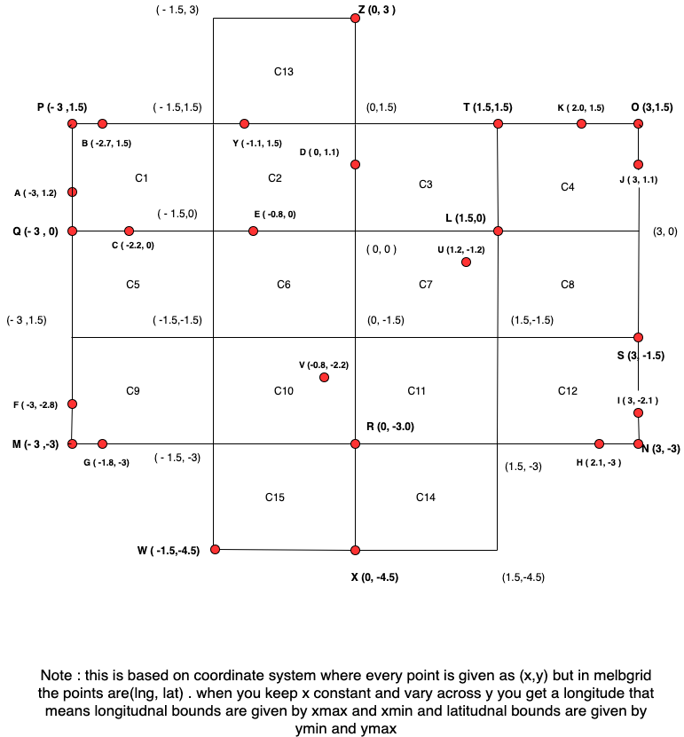

# COMP90024_Assignment1 Summary
Author(s): Soham Mandal, Trina Dey  
Date: 20 Mar 2021

## Given
1. a text file AFINN.txt comprising of sentiments with score  
2. a json file melbGrid.json comprising of Melbourne lat lng divided into a grid of cells  
3. a tiny, small json file containing json data of tweets to test on local and a big json file to test on SPARTAN  

**Note**: big json file not to be run on local and also to be run on SPARTAN precisely thrice as per specification given. Also big json files contains many cities apart from Melbourne 

## Problem Statement  
1. Analyse the sentiment score of each cell area in the grid defined melbgrid.json by parsing tweet files and publish the results  
2. Analyse the performance time of running the program on  
    - 1 node 1 core
	- 1 node 8 core
	- 2 nodes 8 core (4 core each)

## Use Cases & Scenarios 
1. the sentiment defined should match exactly as a word with only punctuations marks allowed at the end of the word (not beginning) [! , ? . ' "] - which means the regex is like [word][!,?.'"] example - abandon[!,.?'"]*$ matches abandon. abandon! but not abandoing or abandon#
2. big json file contains cities apart from melbourne as well that means check on lat lng bounds required.
3. multiple words can match up in a sentence, so add up the sentiment score accordingly
4. Tweet on  vertical Border of B1 (left) | B2 (right) should attribute to left cell B1
5. Tweet on the horizontal border of B2 (top ) and C2 (bottom) should attribute to bottom cell C2
6. application allows running on given no of nodes and cores on spartan (1 node 1 core, 1 node 8 core, 2 nodes, 8 cores) which means application should know when to parallelize
7. application should return final result and time to run the job itself avoiding queueing time.
8. Not mentioned in the assignment pdf but mentioned in one of the lectures and key to optimization is that we should read files in chunks insetad of loading the whole in the memory.

## Deliverable of the Assignment - due on 13th April
1. Report- 4 pages and less comprising of following things -
    - scripts used for submitting job to SPARTAN
	- approach to parallelize the code
	- variations in its performance when run on different configuration
	- single graph (bar chart) showing time for execution  
	
2. Working Demo - comprising of program. 

## Open Questions
1. how do we read files in chunks ? Will File Pointers do?
2. how does program knows how many core and nodes and how to distribute

## Program Flow
1. load AFINN.txt and save into dictionary 
2. load melbGrid.json create list of objects for lat lng
3. function to load files part by part 
4. function to check if tweet is in bounds if yes return cell id else return null, if null then we ignore tweet --- will manage the condition #4 and #5
5. parse text to add up sentiment score for the cell 
6. data structure- cell object will comprise of cell id, cell lat lng, total tweets, sentiment score
7. how to measure performance ? will Timer do at the beginning and end of program
8. how to store result ? display on console or save in a file?
9. how to parallelize with point no 3
10. Added Bonus - To show the result in map with grids and save the result in a png file.
11. Added Bonus - Unit Test Cases 

## Deadlines
| Tasks          | Owner         | Date        |
| -------------- |:-------------:| -----------:|
| #1 and #2      | Soham M       | 25 Mar 2021 |
| #3             | Trina D       | 25 Mar 2021 |
| #4 	#6       | Trina D       | 31 Mar 2021 |
| # 5		     | Soham M       | 31 Mar 2021 |
| #7 #8          | Soham M       | 05 Apr 2021 |
| #9.            | Trina D       | 05 Apr 2021 |
| #10            | Soham M       | 11 Apr 2021 |
| Run on Spartan | undefined     | 07 Apr 2021 |
| Report         | undefined     | 12 Apr 2021 |
| #11            | Trina & Soham | 12 Apr 2021 |

##Grid logic test
The coordinate system is given by (x,y) however in terms of lat lng coordinates usually now its written as (lng, lat)
which means lng varies amongst x axis remains constant on y and lat varies amongst y axis and remains constant against x.

We have 4 scenarios - 
1. the  point may lie inside the cell in which case the point will be strictly within the lat lng bounds
2. the point may lie on one of the outer boundaries (which has one side empty)
3. the point may share cells inside the grid ie inner boundaries
4. the point may be at the corners of the grid
5. the point may be on intersection of 4 cells

Here is the Diagram

As per this we have tested against the below points. To run the test do this   
**pip3 install -U pytest**   
**pytest -q HappyCityAnalysisTest.py**  

 
| Point Name    | Coordinates    |   Cell ID |
| ------------- |:--------------:| ---------:|
|   A           | ( -3 , 1.2)    |   C1      |
|   B           | ( -2.7, 1.5)   |   C1      |
|   C           | ( -2.2, 0.0)   |   C5      |
|   D           | ( 0.0 , 1.1)   |   C2      |
|   E           | ( -0.8, 0.0)   |   C6      |
|   F           | ( -3.0, 2.8)   |   C9      |
|   G           | ( -1.8,-3.0)   |   C9      |
|   H           | ( 2.1, -3.0)   |   C12     |
|   I           | ( 3.0, -2.1)   |   C12     |
|   J           | (  3.0, 1.1)   |   C4      |
|   K           | (  2.0, 1.5)   |   C4      |
|   L           | (  1.5, 0.0)   |   C3      |
|   M           | ( -3.0,-3.0)   |   C9      |
|   N           | (  3.0,-3.0)   |   C12     |
|   O           | (  3.0, 1.5)   |   C4      |
|   P           | ( -3.0, 1.5)   |   C1      |
|   Q           | ( -3.0, 0.0)   |   C5      |
|   R           | (  0.0,-3.0)   |   C10     |
|   S           | (  3.0,-1.5)   |   C8      |
|   T           | (  1.5, 1.5)   |   C3      |
|   U           | (  1.2,-1.2)   |   C7      |
|   V           | ( -0.8,-2.2)   |   C10     |
|   W           | ( -1.5,-4.5)   |   C15     |
|   X           | (  0.0,-4.5)   |   C15     |
|   Y           | ( -1.0, 1.5)   |   C13     |
|   Z           |  ( 0.0, 3.0)  |   C13     |

